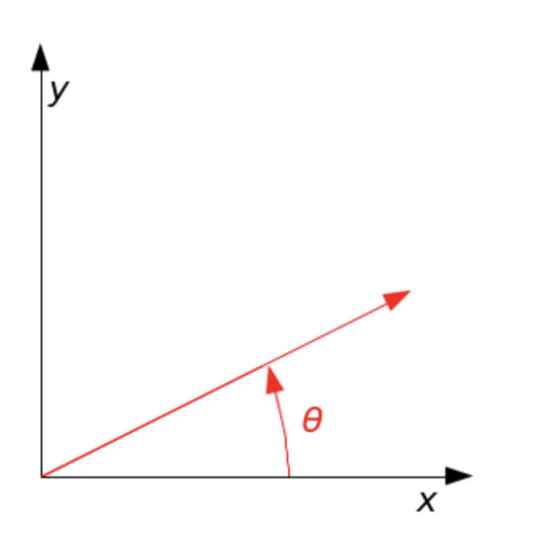
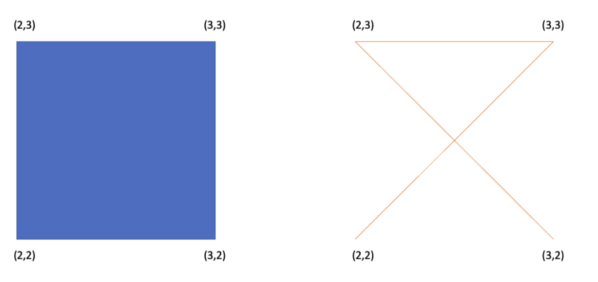

# Programming Abstractions (WARNNING: PLEASE DO NOT PLAGIARISM)
*Computer Science, Stony Brook University*

In this assignment, you will be using Java (make sure it is JDK 1.8 compliant) for programming. Moreover,
this assignment requires you to invest quite a bit into thinking about abstraction before you start coding. It
is based on a mathematical structure called **group**. Before we get to the code, let us define this concept:
A nonempty set of elements G forms a **group** if in G there is a defined binary operation (which we will
denote by · in this document), such that
1. x, y ∈ G implies that x · y ∈ G. This property is called closure, and the set of elements is said to be
closed under the operation.
2. a, b, c ∈ G implies that a · (b · c) = (a · b) · c. In other words, the binary operation is associative.
3. There exists an element e ∈ G such that a · e = e · a = a for all elements a ∈ G. This special element e
is called the identity element of the group.
4. For every a ∈ G, there exists an element b such that a · b = b · a = e. That is, every element has an
inverse. Often, we simply denote it by $a^{−1}$
.

Much like programming, mathematics also relies on abstraction. Groups have become fundamentally important in modern mathematics because they distill the basic structural rules found in almost every important
mathematical structure. Some are very obvious, such as the set of all integers with addition as the binary operation. Note that the same set is NOT a group with multiplication as the operation (no inverse)! However,
as soon as we consider a bigger set, namely, the set of all real numbers, even with multiplication we have a
valid group. These examples serve to show that you should not simply think about the set of elements, but
instead, carefully consider the binary operation together with the set. It is also important to note that the
binary operation may not always be commutative. That is, it is not always the case that a · b = b · a.
For a basic understanding of implementing simple groups, there is some Java code already given to you. The
most important is the interface called Group. It is extensively documented, and students are expected to
pay attention to the details provided there. Next, there is an implementation of the most obvious group we
can think of: the group of all integers under addition. This is provided to you as ZPlus.

(*The name may seem strange, but Z is the standard mathematical symbol to represent the set of integers. And since addition
is the binary operation for this group, I decided to call the class ZPlus.*)

## Finite groups

Based on everything you have seen up to this point, you may think that groups are just a fancy way of
stating the basic properties of numbers. But that is not at all true! To start with, a group need not be
infinite. In fact, you will now be implementing a few finite groups

## Non-commutative groups


As noted earlier, the binary operation of a group need not be commutative. That is, a · b is not always equal
to b · a. This may not be intuitive if you only think of numeric operations. But they make a lot of sense
when we enter the world of geometry. In fact, one of the biggest applications of group theory is in fields
like chemistry and physics, where the structural symmetry of molecules and particles is studied using this
mathematical concept. So much so, that many consider the study of groups to be the “science of symmetry”.
For this assignment, we will look at two very simple examples – an equilateral triangle and a square – and
their symmetries.

**Figure 1**: The eight symmetries of a square: the identity operation that leaves everything as it is, three
rotation operations (around its center by 90◦
, 180◦
, and 270◦
), two reflections around the horizontal and
vertical lines, and two reflections around the two diagonals.


But first, another definition: two shapes are said to be congruent, if they have the same shape and size.
Formally, two shapes are congruent if one can be changed into the other by using a combination of:
- rotations (around a fixed point),
- reflections (around a line that serves as the axis of the reflection), and/or
- translations (a transformation that moves every point in the same direction by the same distance).

Clearly, any shape in the 2-dimensional x-y plane is congruent to itself. Some shapes, however, are congruent
to themselves in more than one way! Any such “extra” congruence is called a symmetry. A square has
eight symmetries, as shown in Fig. 1. Similarly, an equilateral triangle has six symmetries (three rotations
around its center by 0◦
, 120◦
, and 240◦
, and three reflections around the three perpendicular bisectors).
With this background, we are now ready to dive into some actual programming

### Task 1 ###
Let G be the set {±1}, under the standard multiplication of real numbers. Your first task is to implement 
this group in Java, with the name `FiniteGroupOfOrderTwo`.
When thinking about implementing this, note that `Group` is a parameterized interface. In the implemented example, ZPlus, the parameter was obvious, because we already know the data type for
“integers” (`Integer`, of course). But here, the valid data that forms the set of elements, consists of only
two values. So think about what should be the data type of the generic parameter. In your implementation, this parameter class must be named `PlusOrMinusOne`. You should also ensure that the following
driver method (given to you in the `ArithmeticTest` class) works with your code:

```
public static void main(String... args) {
    FiniteGroupOfOrderTwo g = new FiniteGroupOfOrderTwo();
    PlusOrMinusOne[] values = PlusOrMinusOne.values();
    System.out.printf("g.identity() = %s%n", g.identity());
    for (PlusOrMinusOne u : values) {
         for (PlusOrMinusOne v : values) {
            PlusOrMinusOne e = g.binaryOperation(u, v);
            System.out.printf("%s * %s = %s%n", u.toString(), v.toString(), e.toString());
            System.out.printf("inverseOf(%s) = %s%n", e.toString(), g.inverseOf(e).toString());
        }
    }
}
```

In the above code, `toString()` must return only the numeric value (i.e., “1” or “-1”).

**Figure 2**: A radial graph, with one point as the
central node. All other nodes are connected only
to this center by a directed edge. All edges have
the same length, and direct away from the center.


**Figure 3**: A geometric representation of an actual
radial graph. Each point is a Point object, all the
edges have the same length, and every edge direct
away from the center.


### Task 2 ###

There is an interface called `Shape` provided in the `geometry` package. In this question, we will consider 
a `RadialGraph`, which is meant to represent objects of the type shown in Fig. **2** and Fig. **3**. Such graphs
show up all the time in social networks (e.g., the central node represents an influencer with the others
representing followers). Your task in this question is to complete the implementation of the `RadialGraph`
class, consistent with the requirements of the `Shape` interface.
Most of the implementation is straight-forward. Implementing rotation (in the rotateBy(int degrees)
method), however, requires some mathematics!
Formally, rotation in the 2-dimensional Euclidean space is defined by a 2 × 2 matrix. To rotate all the
points in the x-y plane counterclockwise by an angle θ (in radians), with respect to the positive x axis
about the origin, a point (x, y) is transformed by

$$
\begin{bmatrix}
cosθ & -sinθ\\
sinθ & cosθ
\end{bmatrix}	
\begin{bmatrix}
x\\
y
\end{bmatrix}=\begin{bmatrix}
xcosθ -ysinθ\\
xsinθ + ycosθ
\end{bmatrix}	
$$

Without the matrix notation used in linear algebra, this simply means that such a rotation transforms the point (x,y) to the point (xcosθ−ysinθ,xsinθ+ycosθ). Visually, this rotation is shown in Fig. **4**.To rotate a shape using this formula, you need to ensure that the center of the shape is the origin (0, 0).
It is a part of this assignment to figure out how to rotate a shape that has its center somewhere else.
You should ensure that the following driver method in the `RadialGraph` class works with your code (pay attention to the documentation, which explains what must be printed for the test cases used in this driver method, and what exception must be thrown):

```
public static void main(String... args) {
       Point center = new Point("center", 0, 0);
       Point east = new Point("east", 1, 0);
       Point west = new Point("west", -1, 0);
       Point north = new Point("north", 0, 1);
       Point south = new Point("south", 0, -1);
       Point toofarsouth = new Point("south", 0, -2);
       
       // A single node is a valid radial graph.
       RadialGraph lonely = new RadialGraph(center);
       
       // Must print: [(center, 0.0, 0.0)]
       
       System.out.println(lonely);

       // Must throw IllegalArgumentException, since the edges will not be of the same length
       RadialGraph nope = new RadialGraph(center, Arrays.asList(north, toofarsouth, east, west));
       
       Shape g = new RadialGraph(center, Arrays.asList(north, south, east, west));

       // Must follow the documentation in the Shape abstract class, and print the following string:
       // [(center, 0.0, 0.0); (east, 1.0, 0.0); (north, 0.0, 1.0); (west, -1.0, 0.0); (south, 0.0, -1.0)]
       System.out.println(g);

       // After this counterclockwise rotation by 90 degrees, "north" must be at (-1, 0), and
       // similarly for all the other radial points. The center, however, must remain exactly
       // where it was.
       g = g.rotateBy(90);

       // you should similarly add tests for the translateBy(x, y) method
}
```



**Figure 4**: Counterclockwise rotation through angle θ: the vector is initially aligned with the x-axis, and after the rotation, shown by the red arrow.




**Figure 5**: The square (left) initialized by passing arguments (3, 3), (2,3), (2,2), and (3,2) (in this order) is, indeed, a valid square. Without such a convention being followed, we could end up with non-polygonal open curves (right). If the constructor is called with four points that do not form a valid square, your constructor must throw an `IllegalArgumentException`.


### Task 3 ###
Similarly, complete the implementation of the `Square`  class.

An empty constructor is already provided to you, which accepts four `Point`objects as its parameters. It is important to note that whether these points form a valid square may depend on the order in which these points are arranged. This was not a concern for radial graphs, but it does matter for a square! For example, a mistake in ordering the vertices could yield the right-side non-polygonal open curve shown in Fig. **5**. For this assignment, you can assume that the order in which the input arguments are provided to the constructor, will follow the order specified in the documentation of `Shape#toString()`.
Recall that when we attempt to create a radial graph with invalid points, the constructor is required to throw an `IllegalArgumentException`. Similarly, when the `Sqaure` class’ constructor is called with four points that do not follow the above convention, it must throw an IllegalArgumentException.
We are not providing a separate driver method for the `Square` class, because such a driver method will be nearly identical to the one we have provided for `RadialGraph`. You are highly encouraged to test your square implementation using such a method. In this method, you should test 

(i) the creation of squares, 

(ii) throwing exceptions as described above,

 (iii) printing a square, 

(iv) printing a rotated square, 

(v) printing a translated square, and 

(vi) calculating the center point.

### Task 4 ###

Now, we will use these two shapes, RadialGraph and Square, and add the concepts of their symmetry. Take a look at the GeometryTest class’ main(String[]) method. This is provided to you as an outline
for testing your code. Here, you will see two classes being mentioned, called RadialGraphSymmetries and SquareSymmetries. You will also see two methods being used: areSymmetric, and symmetriesOf. Carefully consider the Symmetries interface implemented by these two classes, and come up with the correct signatures for these methods in the implementations. In particular, you need to ask

*If the definition in the interface (i.e., the supertype) specifies returning a type T, can the method implementation in the class (which is its subtype) return a subtype of T? In other words, does Java allow covariant return types?*

As shown in Fig. **1**, a square has eight symmetries (including the identity transformation). Symmetries of radial graphs are different, though. On one hand, the number of symmetries is not fixed (depends on the number of edges and the exact location of the neighbors receiving those edges). On the other hand, if any symmetry other than the identity transformation exists, it can be expressed purely through rotation.

Your task in this question is to implement the symmetries of Square and RadialGraph in the two classes SquareSymmetries and RadialGraphSymmetries, respectively.

In this question, the total points are split equally between the implementation of radial graph symmetries and square symmetries.


